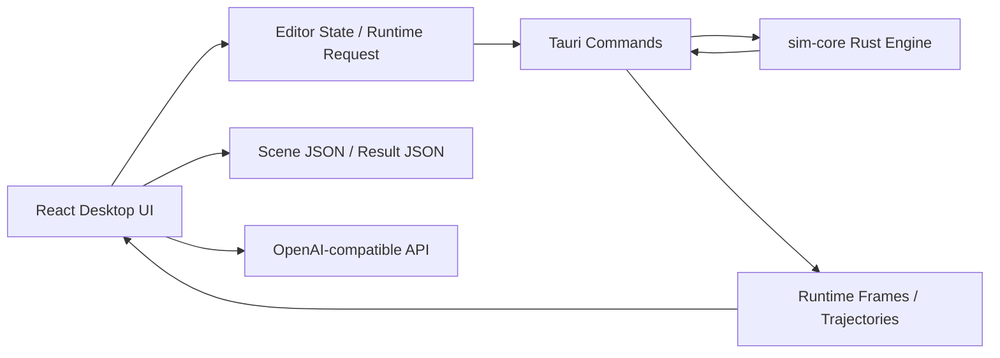

# Physics Sandbox

Physics Sandbox is a desktop classroom mechanics editor and simulation tool for building, running, reviewing, and annotating 2D physics scenes.

Current desktop version: `1.0.70`

## Overview

The project is designed for middle-school and high-school mechanics teaching. It helps teachers and students turn textbook or exam-style mechanics problems into interactive scenes, run precomputed motion, inspect trajectories and velocities, and add classroom annotations.

The current product focus is:

- Fast 2D mechanics scene authoring for classroom demonstrations
- Playback and analysis tools for checking simulated motion
- Natural-language scene drafting from exam-style prompts
- A stable Tauri desktop workflow for local use

This is not a general CAD tool or a full-purpose physics-engine frontend. The design target is a practical classroom workflow: build a mechanics scene, calculate motion, inspect the result, annotate, and export.

## Core Features

### Scene Editing

- Place common mechanics objects: particle, ball, block, board, polygon, and arc track
- Edit object properties such as position, size, radius, angle, mass, velocity, friction, restitution, and locked state
- Snap and align objects while editing
- Automatically create an ideal smooth arc when two board endpoints are close enough
- Zoom the canvas with the mouse wheel
- Pan the canvas by right-dragging empty workspace

### Simulation and Playback

- Precompute motion over a configurable duration
- Play, pause, step, reset, scrub the timeline, and jump to a specific time
- Keep authored scene state separate from calculated runtime state
- Export and import scene files and calculated result files

### Analysis and Teaching Tools

- Show object trajectories
- Select an object to display velocity direction and magnitude
- Open motion charts for position and velocity over time
- Show height and offset readouts for selected balls
- Add ink annotations with color selection, eraser, undo-last-stroke, and cancel mode
- Keep annotations aligned with the scene when the viewport is panned

### AI Text-to-Scene Drafting

- Enter a natural-language mechanics prompt or exam problem
- Generate a scene draft with assumptions, objects, relationships, warnings, and unsupported notes
- Review and edit generated parameters before applying the draft
- Insert the draft into the current scene or replace the current scene
- Use an OpenAI-compatible API configured locally

## Supported Objects and Constraints

### Objects

| Object | Purpose |
| --- | --- |
| Particle | Idealized point-mass-style object |
| Ball | Circular rigid body |
| Block | Rectangular rigid body |
| Board | Surface, rail, floor, or inclined plane |
| Polygon | Custom rigid polygon |
| Arc Track | Smooth circular guide or ideal arc transition |

### Constraints and Relationships

| Constraint / Relationship | Purpose |
| --- | --- |
| Spring | Continuous spring between two entities |
| Track | Linear guide constraint |
| Arc Track | Circular guide constraint |
| Contact Spring End | Fixed spring with a free contact end |
| Energy Release | Instant release of stored spring energy into initial velocities, without a persistent spring |

The `Energy Release` relationship is intended for exam prompts where a compressed tiny spring only separates two bodies at the initial moment. The compiler converts the released total kinetic energy into opposite initial velocities by momentum conservation and does not create a spring constraint.

## Architecture



### Main Packages

- `apps/desktop`
  - React + Vite desktop frontend
  - Editor UI, workspace canvas, inspector panels, playback controls, charts, annotations, and AI scene generation UI
- `apps/desktop/src-tauri`
  - Tauri desktop shell
  - Desktop commands, file dialogs, runtime bridge, and AI request bridge
- `crates/sim-core`
  - Rust simulation core
  - Scene compilation, contacts, constraints, trajectories, and runtime frame generation
- `packages/scene-schema`
  - Shared scene data contracts and TypeScript schema utilities

## Repository Layout

```text
.
├── apps/
│   └── desktop/                # React + Vite desktop frontend
│       └── src-tauri/          # Tauri desktop shell
├── crates/
│   └── sim-core/               # Rust simulation core
├── packages/
│   └── scene-schema/           # Shared scene schema and types
├── docs/
│   ├── development/            # Development and startup docs
│   ├── architecture/           # Contracts and architecture notes
│   └── superpowers/            # Design and implementation records
├── scripts/
│   └── start-desktop.sh        # Recommended desktop startup script
└── .agent/                     # Local Agent Harness
```

## Requirements

- Node.js with `pnpm`
- Rust toolchain with `cargo`
- Platform-specific Tauri prerequisites

Install workspace dependencies:

```bash
pnpm install
```

## Quick Start

### Recommended Desktop Startup

Use the Tauri desktop shell for daily verification. Collision behavior, runtime playback, file dialogs, result export, and AI scene generation should be verified in the desktop shell rather than only in a browser.

```bash
./scripts/start-desktop.sh
```

The script:

1. Checks required tools such as `pnpm`, `cargo`, and `curl`
2. Loads a local `.desktop.env` file when present
3. Starts the frontend development server
4. Starts the Tauri desktop shell

### Direct Tauri Startup

If the frontend development server is already running, start the desktop shell directly:

```bash
cargo run --manifest-path apps/desktop/src-tauri/Cargo.toml
```

### Frontend-Only Development

```bash
pnpm --filter desktop run dev
```

Frontend-only development is useful for UI work, but it does not fully replace desktop-shell verification.

## AI Scene Generation Configuration

Create a local `.desktop.env` file if you need text-to-scene generation. Do not commit real credentials.

Example:

```bash
OPENAI_API_KEY=your-api-key
OPENAI_BASE_URL=https://api.openai.com/v1
OPENAI_MODEL=gpt-5.5
```

Supported variables:

| Variable | Required | Description |
| --- | --- | --- |
| `OPENAI_API_KEY` | Yes | OpenAI or compatible gateway API key |
| `OPENAI_BASE_URL` | No | OpenAI-compatible base URL |
| `OPENAI_MODEL` | No | Defaults to `gpt-5.5` |

Notes:

- `OPENAI_BASE_URL` may be a base URL or a full Responses endpoint URL
- Process environment variables take precedence over `.desktop.env`
- `.desktop.env` is for local development only and should not contain committed real values

## Common Commands

| Command | Purpose |
| --- | --- |
| `pnpm install` | Install workspace dependencies |
| `pnpm test` | Run workspace tests |
| `pnpm desktop:dev` | Start the desktop frontend dev server |
| `pnpm desktop:build` | Build the desktop frontend |
| `pnpm desktop:tauri:check` | Check the Tauri Rust side |
| `pnpm desktop:tauri:dev` | Start the desktop shell through Cargo |
| `./scripts/start-desktop.sh` | Recommended desktop startup |

Common verification commands:

```bash
pnpm -r test
pnpm --filter desktop build
cargo test --manifest-path crates/sim-core/Cargo.toml
cargo test --manifest-path apps/desktop/src-tauri/Cargo.toml
```

## File Formats

### Scene Files

- Format ID: `physics-sandbox-scene`
- Current version: `2`
- Includes scene entities, constraints, force sources, annotations, display settings, selection state, and authoring settings

### Result Files

- Format ID: `physics-sandbox-result`
- Current version: `1`
- Includes a scene snapshot, authoring settings, display settings, precomputed frames, precompute duration, fixed timestep, and app version

Scene files are best for continued editing and sharing problem setups. Result files are best for sharing precomputed motion without recalculating.

## Interaction Notes

### Workspace

- Left-drag an object to move it
- Mouse wheel zooms the canvas
- Right-drag empty workspace to pan the viewport
- Select an object and edit parameters in the Inspector

### Annotation

- Click `Ink` to start annotation mode
- Hold the left mouse button and drag to draw
- Use `Eraser` to remove parts of strokes
- Right-click to remove the previous stroke
- Click `Cancel ink` to leave annotation mode

### Playback and Analysis

- Click `Calculate` before playback
- Use the timeline, time input, step controls, play, pause, and reset
- Select an object to show trajectory, velocity vector, and motion charts

## Classroom Physics Modeling Notes

Physics Sandbox favors idealized classroom mechanics over industrial simulation fidelity.

Typical modeling choices include:

- Rigid-body contacts follow boundary geometry
- Restitution and friction are modeled separately
- Board endpoints can create ideal smooth circular transitions
- Particles, balls, boards, blocks, springs, and tracks are optimized for common mechanics problems
- Height readouts, trajectories, velocity vectors, and charts prioritize teaching clarity

## Local Agent Harness

The repository includes a lightweight local task-pool harness in `.agent/`.

Key files:

- `.agent/backlog.md`: task backlog
- `.agent/rules.md`: safety rules
- `.agent/verify.sh`: verification entry point
- `.agent/run_once.sh`: single-task execution script
- `.agent/runs/`: run logs and summaries

Use this harness to let Codex work through one backlog task at a time while keeping verification output and diffs recorded locally.

## Documentation Index

Development:

- `docs/development/desktop-startup.md`

Architecture:

- `docs/architecture/contracts.md`
- `docs/architecture/coordination.md`
- `docs/architecture/ownership.md`

Design and implementation records:

- `docs/superpowers/specs/`
- `docs/superpowers/plans/`

## Development Notes

- Verify physics runtime changes in the Tauri desktop shell
- Do not commit real `.desktop.env` values
- Do not add machine-local absolute paths, logs, API keys, or account secrets to documentation or tests
- Annotation-only or display-only changes should not trigger unnecessary physics recompilation
- Add automated tests for new behavior to reduce regressions

## Contribution Areas

- More classroom mechanics templates
- Better exam-prompt scene parsing
- Richer charts and measurement tools
- More stable collision and guide-rail models
- Clearer import/export and classroom sharing workflows

## Maintainer

For project coordination, use `code_ljs@qq.com`.

