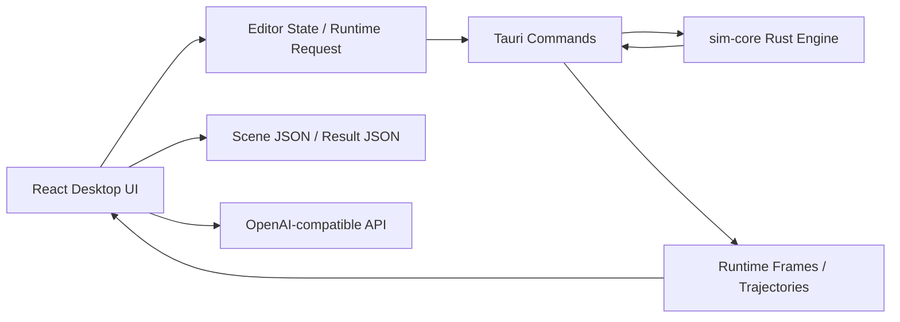

# Physics Sandbox

课堂物理场景编辑与仿真工具，面向“搭建题目场景 -> 运行计算 -> 观察运动 -> 标注讲解”的桌面端工作流。

当前桌面端版本：`1.0.56`

## 项目简介

Physics Sandbox 是一个以中学/高中力学教学为导向的交互式物理场景工具。它支持在画布中摆放常见刚体、设置初速度与表面摩擦、建立弹簧/轨道约束、预计算运动结果，并通过轨迹、速度箭头、运动图表和批注功能辅助讲解。

项目当前重点是：

- 面向课堂演示的 2D 力学场景搭建
- 面向教学检查的可视化回放与分析
- 面向试题理解的文本转场景草稿生成
- 面向桌面使用的稳定 Tauri 壳运行方式

它不是通用 CAD，也不是通用物理引擎前端；当前设计目标是“快速搭建可讲解的课堂力学场景”。

## 核心能力

### 1. 场景编辑

- 拖放物体到场景中：`质点`、`小球`、`物块`、`木板`、`多边形`、`弧形轨道`
- 编辑对象的基本属性：位置、尺寸、半径、角度、质量、速度、摩擦、弹性、锁定状态
- 自动吸附与对齐辅助
- 两段木板端点接近时，可自动生成光滑圆弧连接
- 鼠标滚轮缩放场景，右键拖拽平移场景

### 2. 运行与回放

- 预计算运动结果
- 时间轴拖动、时间跳转、单步播放、暂停、重置
- 运行结果与编辑态之间切换
- 导入/导出计算结果，便于复盘与分享

### 3. 分析与教学展示

- 显示对象运动轨迹
- 选中对象后显示速度方向、速度大小
- 运动图表：位移/速度随时间变化
- 选中小球时显示高度读数，例如：
  - 支撑面落差
  - 球心落差
  - 偏移差
- 场景批注：墨迹、颜色切换、局部橡皮擦、撤销上一笔
- 批注跟随场景视口平移，不会与场景脱节

### 4. AI 文本转场景

- 输入自然语言或试题题干
- 生成“场景草稿 + 假设说明 + 物体列表 + 警告/限制”
- 支持将草稿插入当前场景或替换当前场景
- 通过 OpenAI 兼容接口在桌面端本地配置

## 当前对象与约束

### 已开放物体

| 类别 | 说明 |
| --- | --- |
| Particle | 质点，用于理想化点质量场景 |
| Ball | 小球 |
| Block | 物块 |
| Board | 木板/平面 |
| Polygon | 多边形刚体 |
| Arc Track | 弧形轨道/光滑圆弧导向 |

### 已开放约束

| 约束 | 说明 |
| --- | --- |
| Spring | 两物体间弹簧 |
| Track | 线性导向轨道 |

### 已在界面中出现但当前未作为完整工作流开放的项目

- Rod
- Anchor
- Probe
- Ruler
- Angle Tool

这些条目目前更接近占位或后续扩展方向，README 不将其视为完整可交付功能。

## 技术架构



### 主要组成

- `apps/desktop`
  - React + Vite 桌面前端
  - 负责编辑器、画布、属性面板、回放控制、图表、批注、AI 场景生成 UI
- `apps/desktop/src-tauri`
  - Tauri 桌面壳
  - 负责桌面命令、文件对话框、AI 请求桥接
- `crates/sim-core`
  - Rust 物理运行核心
  - 负责场景编译、碰撞、导向、轨迹和运行帧生成
- `packages/scene-schema`
  - 共享场景数据结构和序列化契约

## 仓库结构

```text
.
├── apps/
│   └── desktop/                # React + Vite 桌面前端
│       └── src-tauri/          # Tauri 桌面壳
├── crates/
│   └── sim-core/               # Rust 仿真核心
├── packages/
│   └── scene-schema/           # 场景 schema 与共享类型
├── docs/
│   ├── development/            # 开发和启动文档
│   ├── architecture/           # 结构与协作文档
│   └── superpowers/            # 设计与实现计划记录
├── scripts/
│   └── start-desktop.sh        # 推荐桌面启动脚本
└── .agent/                     # 本地 Agent Harness
```

## 开发环境要求

开始前请准备：

- Node.js（建议使用与 `pnpm` 兼容的现代版本）
- `pnpm`
- Rust 工具链（`cargo` 可用）
- 当前操作系统对应的 Tauri 前置依赖

安装依赖：

```bash
pnpm install
```

## 快速开始

### 推荐：启动桌面端

桌面壳是推荐的日常运行方式。对于碰撞、预计算回放、文件导入导出、AI 场景生成等功能，应优先在桌面端验证，而不是只在浏览器中验证。

```bash
./scripts/start-desktop.sh
```

这个脚本会：

1. 检查 `pnpm`、`cargo`、`curl`
2. 在需要时加载仓库根目录下的 `.desktop.env`
3. 启动前端开发服务
4. 启动 Tauri 桌面壳

### 直接使用 Cargo 启动桌面壳

如果你已经手动启动了前端开发服务器，也可以直接运行：

```bash
cargo run --manifest-path apps/desktop/src-tauri/Cargo.toml
```

### 仅启动前端调试

仅前端开发时可用：

```bash
pnpm --filter desktop run dev
```

但请注意：浏览器环境不能完全代替桌面壳验证。某些桌面行为、文件对话框和运行时桥接能力只在 Tauri 下成立。

## AI 场景生成功能配置

如果你需要“文本转场景”能力，请在本地准备一个 `.desktop.env` 文件。不要将真实密钥提交到仓库。

示例：

```bash
OPENAI_API_KEY=your-api-key
OPENAI_BASE_URL=https://api.openai.com/v1
OPENAI_MODEL=gpt-5.4-mini
```

### 支持的环境变量

| 变量名 | 是否必需 | 说明 |
| --- | --- | --- |
| `OPENAI_API_KEY` | 必需 | OpenAI 或兼容网关的 API Key |
| `OPENAI_BASE_URL` | 可选 | 默认是 OpenAI 官方兼容基地址 |
| `OPENAI_MODEL` | 可选 | 默认值为 `gpt-5.4-mini` |

说明：

- `OPENAI_BASE_URL` 可以是基础地址，也可以是完整的 Responses 端点地址
- 环境变量优先级高于 `.desktop.env`
- `.desktop.env` 只用于本地开发，不应提交真实值

## 常用命令

### 根目录脚本

| 命令 | 说明 |
| --- | --- |
| `pnpm install` | 安装工作区依赖 |
| `pnpm test` | 运行工作区测试 |
| `pnpm desktop:dev` | 启动桌面前端开发服务器 |
| `pnpm desktop:build` | 构建桌面前端 |
| `pnpm desktop:tauri:check` | 检查 Tauri Rust 端 |
| `pnpm desktop:tauri:dev` | 直接用 Cargo 启动桌面壳 |
| `./scripts/start-desktop.sh` | 推荐桌面启动方式 |

### 常用验证命令

```bash
pnpm -r test
pnpm --filter desktop build
cargo test --manifest-path crates/sim-core/Cargo.toml
cargo test --manifest-path apps/desktop/src-tauri/Cargo.toml
```

## 导入 / 导出文件格式

### 1. 场景文件

- 格式标识：`physics-sandbox-scene`
- 当前版本：`2`
- 文件内容包含：
  - 场景实体
  - 约束
  - 力源
  - 批注
  - 显示设置
  - 选中状态
  - 场景 authoring 设置

### 2. 运行结果文件

- 格式标识：`physics-sandbox-result`
- 当前版本：`1`
- 文件内容包含：
  - 场景快照
  - authoring 设置
  - 显示设置
  - 预计算帧序列
  - 预计算时长
  - 时间步长
  - 导出时应用版本

### 3. 文件用途建议

- 场景文件：适合继续编辑、共享题目搭建结果
- 运行结果文件：适合共享已经算好的运动过程，避免重复计算

## 交互说明

### 场景操作

- 左键拖动物体：移动对象
- 鼠标滚轮：缩放画布
- 右键拖动画布空白区域：平移视口
- 选中对象后：在右侧 Inspector 中编辑参数

### 批注

- 点击 `Ink` 开始批注
- 鼠标左键按住拖动：绘制墨迹
- `Eraser`：局部擦除
- 右键：删除上一笔
- `Cancel ink`：退出批注模式
- 视口拖动时，已有批注会跟随场景平移

### 回放与分析

- 先点击 `Calculate`
- 计算后可播放、暂停、单步、拖动时间轴
- 选中对象后可打开 `Motion charts`
- 可选择显示轨迹、速度箭头等分析叠加层

## 课堂物理建模特点

这个项目当前偏向理想化课堂模型，而不是工业级连续介质仿真。

典型特征包括：

- 刚体接触以边界几何为准
- 弹性碰撞与摩擦分开建模
- 木板端点可自动生成理想光滑圆弧连接
- 质点、小球、木板、物块等对象围绕典型力学题搭建
- 高度读数、轨迹、速度箭头、图表等教学辅助信息优先

## 本地 Agent Harness

仓库包含一个轻量本地任务池框架，目录为 `.agent/`。

主要文件：

- `.agent/backlog.md`：任务池
- `.agent/rules.md`：安全规则
- `.agent/verify.sh`：统一验证入口
- `.agent/run_once.sh`：单轮执行脚本
- `.agent/runs/`：每轮输出记录

如果你要让 Codex 按任务池持续开发，可以先维护 backlog，再使用这个 harness 驱动单任务执行。

## 文档索引

### 开发

- `docs/development/desktop-startup.md`

### 架构

- `docs/architecture/contracts.md`
- `docs/architecture/coordination.md`
- `docs/architecture/ownership.md`

### 设计 / 实施记录

- `docs/superpowers/specs/`
- `docs/superpowers/plans/`

## 开发注意事项

- 对物理运行行为的改动，优先在桌面壳中验证
- 不要提交真实 `.desktop.env` 内容
- 不要把本机绝对路径、日志、API Key、账号信息写入文档或测试
- 如果只改了批注或显示层，不应无意义触发整套物理重算
- 新增行为改动时，优先补自动化测试，避免回归

## 适合的贡献方向

- 更多课堂力学场景模板
- 更强的文本转场景解析能力
- 更完整的图表与测量工具
- 更稳定的碰撞与导向物理模型
- 更清晰的导入导出与课堂分享工作流

---

如果你是第一次进入这个仓库，建议顺序是：

1. `pnpm install`
2. 阅读 `docs/development/desktop-startup.md`
3. 运行 `./scripts/start-desktop.sh`
4. 在桌面端完成一次“搭场景 -> Calculate -> 回放 -> 批注 -> 导出”的完整流程
